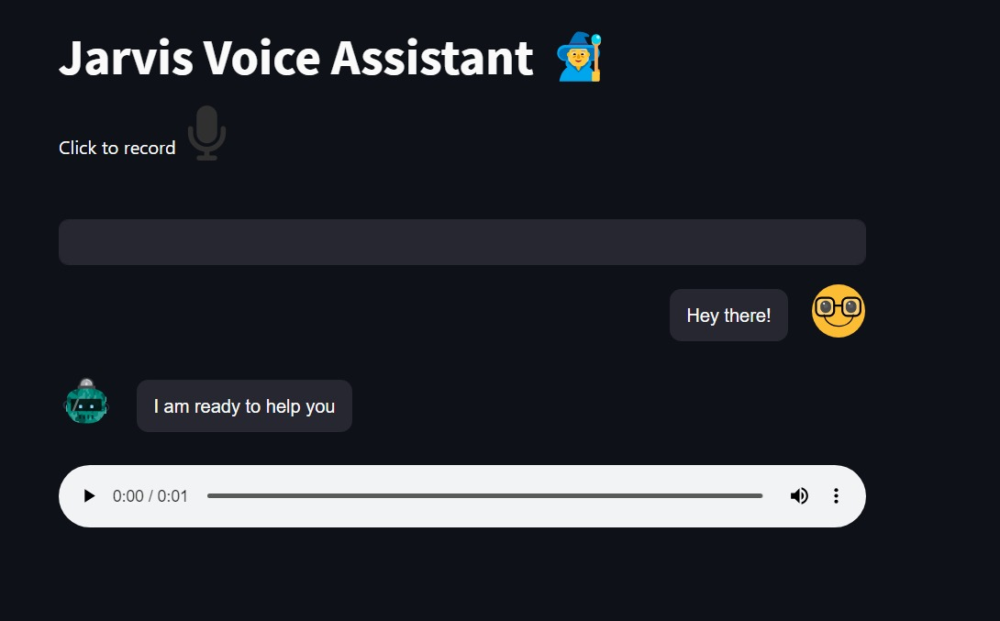

# Jarvis Voice Assistant

An AI-powered voice assistant that answers questions by searching a knowledge base built from Python library docs. Uses OpenAI Whisper, DeepLake, ChatGPT, and ElevenLabs.



## Live Demo

You can access the live deployment of the Jarvis Voice Assistant on Streamlit Cloud: [Jarvis Voice Assistant](https://jarvis-voice.streamlit.app/)


## Overview

This project creates a conversational assistant using:

- **OpenAI Whisper** for speech-to-text transcription.
- **DeepLake** vector database for document storage/retrieval. 
- **ChatGPT** to generate responses.
- **ElevenLabs** for text-to-speech voice outputs.
- **Streamlit** for the web interface.

It scrapes Python library docs from Hugging Face Hub to build the knowledge base. Queries in text or voice are transcribed, searched against the database, and answered by the AI assistant.

## Usage

### Setup  

1. Rename the ".env copy" file to ".env".
2. Run `python scrape.py` once to populate the knowledge base.

### Run

- `streamlit run chat.py` to start the assistant app locally.

## API Keys & Tokens

Before running the voice assistant, you'll need to obtain several API keys and tokens. Here's how to get them:

### OpenAI API Key

1. Go to [OpenAI Platform](https://platform.openai.com/).
2. If you don't have an account yet, click on "Sign Up" to create one. If you already have an account, log in.
3. Once logged in, navigate to the API key section at [OpenAI API Keys](https://platform.openai.com/account/api-keys). 
4. Click "Create new secret key" and give the key a recognizable name or ID.
5. Copy the generated API key.

### Eleven Labs API Key 

1. Visit [Eleven Labs](https://elevenlabs.io/) and click on "Sign Up" to create an account.
2. After creating an account, log in and navigate to the "API" section.
3. Click the "Create API key" button and follow the prompts to generate a new API key. 
4. Copy the generated API key.

### ActiveLoop Token and Organization ID

1. Head over to [Activeloop](https://www.activeloop.ai/) and click on “Sign Up” to create an account.
2. Once you have an Activeloop account, navigate to the Deep Lake App (Organization Details -> API Tokens).
3. Click the "Create API key" button and generate a new API Token.
4. Copy the generated API token.
5. Your ActiveLoop Organization ID is, by default, your username.

**Setting the Keys, Tokens, and Organization ID**:

After obtaining the keys, tokens, and ID, you can set them in your environment variables or directly in the respective scripts. For environment variables:

```python
import os

os.environ['OPENAI_API_KEY'] = '<your-openai-api-key>' 
os.environ['ELEVEN_API_KEY'] = '<your-eleven-api-key>'
os.environ['ACTIVELOOP_TOKEN'] = '<your-activeloop-token>'
os.environ['ACTIVELOOP_ORG_ID'] = '<your-activeloop-org-id>'
```

Replace `<your-openai-api-key>`, `<your-eleven-api-key>`, `<your-activeloop-token>`, and `<your-activeloop-org-id>` with the keys, tokens, and ID you obtained.

### Adding or Updating URLs to Scrape

To add or update the URLs that the scraper targets from the Hugging Face documentation, you can modify the `get_documentation_urls` function in the `scrape.py` script. Here's a snippet of the function:

```python
def get_documentation_urls():
    # List of relative URLs for Hugging Face documentation pages
    return [
		    '/docs/huggingface_hub/guides/overview',
		    '/docs/huggingface_hub/guides/download',
		    '/docs/huggingface_hub/guides/upload',
		    '/docs/huggingface_hub/guides/hf_file_system',
		    '/docs/huggingface_hub/guides/repository',
		    '/docs/huggingface_hub/guides/search',
		    # You may add additional URLs here or replace all of them
    ]
```

To add more URLs, simply append them to the list. If you want to replace the existing URLs, you can modify the list accordingly.